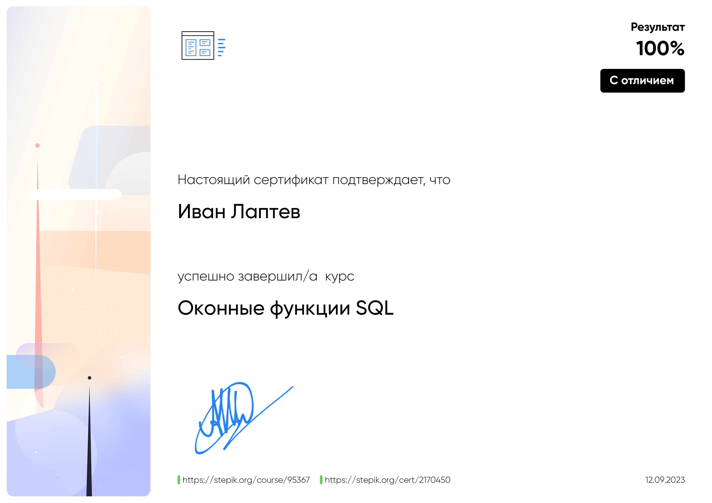

  

  <h1>
 Hello, I'm Ivan
  
</h1>
  

<h1>
</h1>
  

### :man_technologist: Обо мне:
  Я Аналитик Данных  с техническим образованием.
- :telescope: Работать с цифрами, хорошо ориентируюсь в больших объемах информации.

- :seedling: Люблю анализировать digital продукты, исследовать, искать точки роста, предпочитаю принимать решения на основе данных.

- :zap: Свободное время занимаюсь спортом, отдыхаю на природе.

- :mailbox:Как связаться со мной: 

<h1>
</h1>

### :hammer_and_wrench: Языки и инструменты :

  &nbsp;
  &nbsp;
  &nbsp;
  &nbsp;
  &nbsp;
  &nbsp;
  &nbsp;
  &nbsp;
  &nbsp;
  &nbsp;
  &nbsp;
  &nbsp;
  &nbsp;

<h1>
</h1>

### :metal: Умею:
<ul>
<li>Проведение А/В тестов и bootstrap, регрессионного и когортного анализа с помощью python
<li>SQL: вложенные запросы, оконные функции, конструкции case
<li>Написание ad-hoc запросов
<li>Работа над проектами в системе контроля версий git
<li>Формирование дашбордов
<li>Расчет ключевых метрик продукта: ARPU, ARPPU, retention, conversion, churn rate
<li>Автоматизация процессов через Airflow
</ul>

### :book: Мои проекты:
За время обучения на курсе "Аналитик данных" и проектную деятельность мной выполнено около 25 проектов. Здесь собрал наиболее интересные:
|Название проекта| Описание проекта| Стек|
|----------------|-----------------|-----|
|[Онлайн-магазин](https://github.com/laptev512/project_e_commerce_RFM/tree/main)|Предобработка данных, когортный анализ, RFM-анализ.|**Pandas** **Numpy**|
|[Анализ продуктовых метрик](https://github.com/laptev512/Bootstrap_A_B_testing)|Анализ А/B теста и bootstrap для определения значимости изменений в CR и ARPPU, формирование группы метрик при изменении механики приложения. Написание функций для автоматического подсчета и визуализации метрик.|**Pandas** **Numpy** **Scipy** **Tdqm** **Seaborn** **Requests**|
|[Взаимодействие пользователей с рекламными объявлениями](https://github.com/laptev512/interactions-of-advertisements)|Расчет скользящих средних, предобработка данных, сегментация пользователей.|**Pandas** **Numpy** **Plotly** **Seaborn**|
|[Сервис по доставке продуктов на дом](https://github.com/laptev512/cohort_ROMI_delivery)|Предобработка данных, анализ А/B теста. |**Pandas** **Numpy** **Pylab** **Seaborn**|
|[Система рекомендаций для мобильного приложения](https://github.com/laptev512/analysis_A-B_test)|Обрабатываем данные, расчет метрик: DAU, CR, ROMI. Когортный анализ. Создание воронки. |**Pandas** **Numpy** **Scipy** **Seaborn** **pingouin**|
|[Создаем Дашборд анализ премирования сотрудников](https://public.tableau.com/views/Monetary_16867321878180/Dashboardemployeebonuses?:language=en-US&publish=yes&:display_count=n&:origin=viz_share_link), [Canvas](https://github.com/laptev512/Tableau_Dashboard_bonuses/blob/main/Dashboard_Canvas_bonuses.pptx)|Построение графиков с использованием новых полей, верстка дашборда. |**Tableau** **Canvas**|

### Обучение:

Сертификат доступен по ссылке https://stepik.org/cert/1802691

Сертификат доступен по ссылке https://stepik.org/cert/2170450

### Мероприятия:

<!--
**laptev512/laptev512** is a ✨ _special_ ✨ repository because its `README.md` (this file) appears on your GitHub profile.

Here are some ideas to get you started:

- 🔭 I’m currently working on ...
- 🌱 I’m currently learning ...
- 👯 I’m looking to collaborate on ...
- 🤔 I’m looking for help with ...
- 💬 Ask me about ...
- 📫 How to reach me: ...
- 😄 Pronouns: ...
- ⚡ Fun fact: ...
-->
